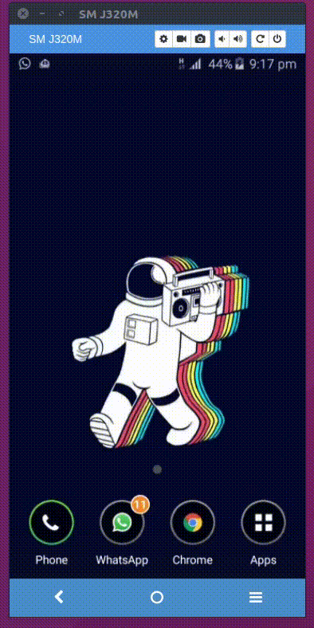

# Optical character recognition
Optical Character Recognition (OCR) gives a computer the ability to read text that appears in an image, letting applications make sense of signs, articles, flyers, pages of text, menus, or any other place that text appears as part of an image. 
---

  

